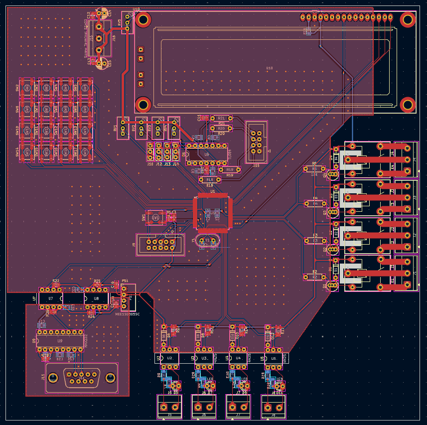

# Placa de Circuito Impresso




## Descrição

Este projeto consiste no design de uma Placa de Circuito Impresso (PCB) voltada para aplicações de controle, automação e desenvolvimento. A placa integra diversas interfaces de entrada, saída e comunicação em um único hardware, tornando-a ideal para controle de processos industriais, automação residencial ou projetos acadêmicos avançados.

## Principais Recursos

Essa placa foi o projeto final da cadeira de Construção de Dispositivos Digitais do curso de Engenharia da Computação. Ela contém:

* **Processamento Central:** Espaço dedicado para o microcontrolador principal (U1) com pinos de programação/debug e cristal oscilador (Y1).
* **Interface de Usuário (IHM):**
    * **Teclado Matricial 4x4:** Matriz de 16 botões (SW2 a SW17) para entrada de dados e navegação.
    * **Display LCD:** Interface no topo da placa (U10) para conexão de displays LCD (ex: 16x2 ou 20x4).
* **Acionamento de Potência:**
    * **4x Relés Independentes:** (K1 a K4) com conectores tipo borne para acionamento seguro de cargas AC/DC externas.
* **Isolamento e Segurança:**
    * **Entradas/Saídas Optoisoladas:** CI's dedicados (U2 a U5) para proteção do circuito lógico contra ruídos e picos de tensão das interfaces externas.
* **Comunicação:**
    * **Porta Serial RS-232:** Conector DB9 (J11) em conjunto com o driver MAX232 (U9) para comunicação com CLP's, computadores e equipamentos legados.
* **Tratamento de Sinais Analógicos:**
    * Circuito com Amplificador Operacional (TL084 - U6) e múltiplos trimpots (RV1 a RV4) para calibração, condicionamento e ajuste de ganhos de sensores analógicos.
* **Conectividade:**
    * Múltiplos terminais de parafuso (screw terminals) nas bordas da placa para facilitar a ligação de sensores, fontes de alimentação e atuadores.

## Características do projeto

* **Software:** KiCAD
* **Camadas:** Placa de dupla face (Top e Bottom layers visíveis pelas trilhas vermelhas e azuis).

## Estrutura do Projeto

```text
├── assets/
│   └── schematic_view.jpeg   # Imagens e renderizações da placa
│   └── top_view.jpeg         # Parte superior da placa
│   └── bottom_view.jpeg      # Parte inferior da placa
├── gerbers                   # Arquivos para fabricação da PCB
├── pasta do projeto          # Pasta com projeto KiCAD
└── Planilha de preços.ods    # Planilha com preço e link dos componentes
```

## Como abrir o arquivo

1. Faça o clone do repositório.
2. Acesse a pasta `pasta do projeto` abra `av3.kicad_pro`.
